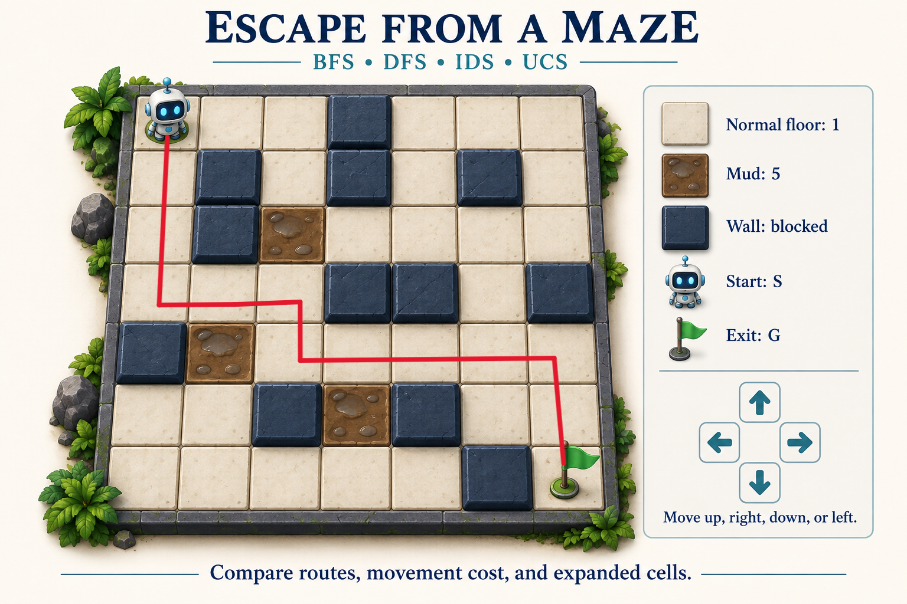
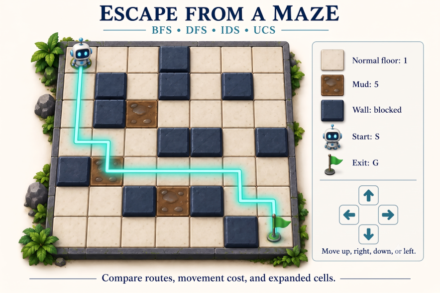

<!-- HEADER SECTION -->
<div align="center">

# Academic Colab Notebooks

**A curated archive of academic coursework, algorithmic problem sets, and practical data science experiments.**

<!-- BADGES -->
[](#)
[](https://shawkath646.dev)
[](https://clouburstlab.com)
[](#-license)
[](#)

</div>

---

### 📋 Project Overview

| Property | Details |
| :--- | :--- |
| **Author** | [Shawkat Hossain Maruf](https://shawkath646.dev) |
| **Platform** | Google Colab / Jupyter Notebooks (Python 3.10+) |
| **Period / Timeline** | Jun 2026 – Oct 2026 |
| **Status** | Active Archive / Academic Practice |
| **Primary Stack** | Python, GeoPandas, NumPy, Pandas, Matplotlib, SciPy |

---

> [!IMPORTANT]
> **Academic Practice & Coursework Notice**  
> This repository is **not a single unified software application or product**. Rather, it serves as an organized academic archive of university coursework assignments, algorithmic problem sets, and statistical data science experiments developed for academic evaluations and algorithmic study. Incomplete drafts, ad-hoc scratchpads, and duplicate exercise templates have been pruned and organized into clean, reproducible notebooks optimized for GitHub viewing and Google Colab execution.

---

## 📱 Preview & Overview

<div align="center">
  
  
</div>

---

## 🎯 Purpose & Scope

### Why It Exists
This repository centralizes academic coursework and computational laboratory assignments across **Artificial Intelligence** (state space exploration and heuristic pathfinding) and **Data Science** (statistical inference and exploratory data analysis). It documents hands-on implementations of classical computer science algorithms and empirical data analysis methodologies.

### What It Covers
- **State Space & Graph Exploration:** Rigorous implementations of Breadth-First Search (BFS), Depth-First Search (DFS), Iterative Deepening Search (IDS), and Uniform Cost Search (UCS) over discrete 2D grid mazes featuring impassable barriers and weighted mud terrain penalties.
- **Geospatial Heuristic Pathfinding:** Implementation of the A* search algorithm over Bangladesh's 64-district road network using great-circle Haversine heuristics and GeoPandas national boundary shapefiles.
- **Exploratory Data Analysis & Hypothesis Testing:** Rigorous data cleaning, missing value imputation, descriptive statistics, and Welch's two-sample t-test hypothesis testing on historical demographic datasets.

---

## 📂 Curated Notebook Portfolio

| # | Notebook | Focus Domain | Key Techniques & Libraries | Open in Colab |
| :-: | :--- | :--- | :--- | :-: |
| **01** | [`01_maze_search_algorithms.ipynb`](./01_maze_search_algorithms.ipynb) | Artificial Intelligence / Search | BFS, DFS, IDS, UCS, Priority Queues, Grid Benchmarking | [](https://colab.research.google.com/github/shawkath646/academic-colab-notebooks/blob/main/01_maze_search_algorithms.ipynb) |
| **02** | [`02_bangladesh_district_navigation_astar.ipynb`](./02_bangladesh_district_navigation_astar.ipynb) | Heuristic Search & GIS | A* Algorithm, Haversine Distance, GeoPandas, Shapely | [](https://colab.research.google.com/github/shawkath646/academic-colab-notebooks/blob/main/02_bangladesh_district_navigation_astar.ipynb) |
| **03** | [`03_titanic_eda_statistical_inference.ipynb`](./03_titanic_eda_statistical_inference.ipynb) | Applied Data Science | Pandas, NumPy, SciPy (Welch's t-test), Matplotlib | [](https://colab.research.google.com/github/shawkath646/academic-colab-notebooks/blob/main/03_titanic_eda_statistical_inference.ipynb) |

---

### 🔬 Detailed Notebook Summaries

#### 1. Maze Navigation & Grid Search Algorithms (`01_maze_search_algorithms.ipynb`)
- **Objective:** Solve a 2D grid maze navigation problem where a robotic agent must traverse from start cell `S` to goal cell `G` while circumventing impassable wall cells (`W`) and navigating through weighted penalty tiles (mud cells).
- **Algorithms Implemented:**
  - `BFS` (Breadth-First Search): Unweighted shortest-step path discovery using FIFO queue.
  - `DFS` (Depth-First Search): Recursive depth-first exploration with visited-node tracking.
  - `IDS` (Iterative Deepening Search): Combines the memory efficiency of DFS ($O(bd)$) with the completeness of BFS.
  - `UCS` (Uniform Cost Search): Min-priority queue exploration factoring in cumulative tile weights.
- **Empirical Experiments:**
  - Evaluated on a 7x7 grid benchmark.
  - Stress-tested under normal penalty (cost 5) vs. heavy mud penalty (cost 10) to observe dynamic path diversion.
  - Includes discussion analyzing frontier memory consumption, neighbor expansion order sensitivity, and optimality guarantees.
- **Optimization Note:** Extracted 4 large embedded base64 screenshots into [`assets/images/maze/`](./assets/images/maze/) to reduce notebook file size by 99.8% (from ~10.6 MB down to ~21 KB) for instant web rendering on GitHub.

#### 2. Bangladesh Inter-District Road Routing with A* Search (`02_bangladesh_district_navigation_astar.ipynb`)
- **Objective:** Compute the optimal travel path between administrative districts of Bangladesh using the informed A* search algorithm.
- **Key Features:**
  - Comprehensive coordinate dataset containing latitude and longitude coordinates for all 64 districts of Bangladesh.
  - Admissible heuristic formulation using great-circle Haversine distance with scale validation ($\alpha \le 1$) to ensure $h(n) \le h^*(n)$.
  - Connected district road graph network.
  - Geospatial visualization using GeoPandas, plotting district boundaries from Bangladesh GeoJSON and overlaying the optimal path with custom path effects.
  - Pre-computed demonstration route: **Dhaka $\rightarrow$ Chittagong**.

#### 3. Titanic Disaster EDA & Statistical Hypothesis Testing (`03_titanic_eda_statistical_inference.ipynb`)
- **Objective:** Conduct an end-to-end exploratory data analysis and statistical validation on the Kaggle Titanic disaster passenger dataset.
- **Key Features:**
  - Data inspection, structural profiling, and type verification.
  - Handling missing data using mean and median imputation techniques on passenger `Age`.
  - Statistical metrics computed with NumPy (mean, standard deviation, variance, and percentile distributions of ticket `Fare`).
  - **Hypothesis Testing:** Two-sample Welch's t-test (`scipy.stats.ttest_ind` with `equal_var=False`) comparing ages of survivors vs. non-survivors ($p \approx 0.04 < 0.05$), rejecting the null hypothesis.
  - Matplotlib histograms visualizing age distributions stratified by survival outcome.
  - Multi-variable aggregation (`groupby`) investigating the intersection of socio-economic class (`Pclass`) and gender (`Sex`).
  - Concluding analytical mini-report summarizing demographic factors governing survival probability.
  - Bundled dataset [`data/titanic-Dataset.csv`](./data/titanic-Dataset.csv) with automated download fallback to ensure 100% reproducibility out of the box.

---

## 💡 Key Algorithmic Insights

- **Uninformed vs. Informed Search:** While BFS guarantees the fewest steps, it is cost-blind and incurs exponential memory growth $O(b^d)$ in frontier queues. UCS guarantees cost-optimality on weighted grids but explores uniformly in all directions. A* integrates domain-specific heuristics $h(n)$ to direct search toward the goal, drastically reducing expanded nodes.
- **Heuristic Admissibility & Consistency:** For A* to be admissible on a road network, straight-line distance must never overestimate actual road distance. A scaling factor heuristic ensures mathematical admissibility even when road curves increase real traversal distances.
- **Parametric vs. Non-Parametric Inference:** Missing data imputation significantly shifts sample variances; using Welch's t-test accounts for heteroscedasticity between survivor cohorts without assuming equal variances.

---

## 🛠️ Tech Stack & Dependencies

- **Languages:** Python 3.10+
- **Core Scientific Stack:** [NumPy](https://numpy.org/), [Pandas](https://pandas.pydata.org/), [SciPy](https://scipy.org/), [Matplotlib](https://matplotlib.org/)
- **Geospatial & Vector Mapping:** [GeoPandas](https://geopandas.org/), [Shapely](https://shapely.readthedocs.io/)
- **Interactive Execution:** [Google Colab](https://colab.research.google.com/), [Jupyter Lab](https://jupyter.org/)

---

## 🚀 Getting Started

### Prerequisites
Make sure you have the following installed locally:
- `Python >= 3.10`
- `pip` or virtual environment tool (`venv`, `conda`)
- `git`

### Option 1: Run in Google Colab (Recommended)
Click any of the **Open in Colab** badges in the [Curated Notebook Portfolio](#-curated-notebook-portfolio) table to launch notebooks in a browser with zero local configuration.

### Option 2: Run Locally via Jupyter

```bash
# 1. Clone the repository
git clone https://github.com/shawkath646/academic-colab-notebooks.git
cd academic-colab-notebooks

# 2. Create and activate a virtual environment
python -m venv venv
# On Windows:
venv\Scripts\activate
# On macOS/Linux:
source venv/bin/activate

# 3. Install dependencies
pip install -r requirements.txt

# 4. Launch Jupyter Notebook / JupyterLab
jupyter notebook
```

---

## 🗂️ Repository Structure

```
academic-colab-notebooks/
├── .gitignore
├── LICENSE
├── README.md
├── requirements.txt
├── titanic-Dataset.csv                       # Dataset mirror for root execution
├── 01_maze_search_algorithms.ipynb           # Assignment 1: BFS, DFS, IDS, UCS on weighted grid
├── 02_bangladesh_district_navigation_astar.ipynb # Project: A* geospatial routing over 64 districts
├── 03_titanic_eda_statistical_inference.ipynb  # Coursework: EDA & Welch's t-test on Titanic dataset
├── assets/
│   └── images/
│       └── maze/
│           ├── bfs_solution.png              # Extracted BFS traversal visualization
│           ├── dfs_solution.png              # Extracted DFS traversal visualization
│           ├── ids_solution.png              # Extracted IDS traversal visualization
│           └── ucs_solution.png              # Extracted UCS traversal visualization
└── data/
    └── titanic-Dataset.csv                   # Structured dataset directory
```

---

## 🧹 Excluded Drafts & Archival Notes

To maintain repository quality, incomplete draft files and scratchpads have been filtered:
- `BFS Algo Practice.ipynb`: A preliminary 1-cell BFS test containing an unimplemented `dfs_algo` placeholder; completely superseded by the comprehensive implementations in `01_maze_search_algorithms.ipynb`.
- `Untitled0.ipynb`: An ad-hoc scratchpad containing duplicate toy Logistic Regression, 6-sample KMeans, and terminal Q-learning snippets.
- `titanic_tutorial.ipynb`: The uncompleted problem sheet template with empty `# TODO` placeholders; replaced by the completed, documented submission in `03_titanic_eda_statistical_inference.ipynb`.

---

## 🤝 Contributing & Support

Because this repository houses personal academic coursework and practice history, pull requests adding unrelated code are not accepted. However, feedback, issues, or algorithmic suggestions are welcome!

1. Fork the Project
2. Create your Feature Branch (`git checkout -b feature/Improvement`)
3. Commit your Changes (`git commit -m 'Add note on heuristic scale'`)
4. Push to the Branch (`git push origin feature/Improvement`)
5. Open a Pull Request

If you discover any issues, please submit them on the [Issue Tracker](https://github.com/shawkath646/academic-colab-notebooks/issues).

---

## 📄 License

Distributed under the [MIT License](LICENSE). See [`LICENSE`](LICENSE) for more information.

---

<!-- BRANDING FOOTER -->
<div align="center">
  <sub>Engineered by</sub><br/>
  <strong><a href="https://shawkath646.dev">Shawkat Hossain Maruf</a></strong>
  <br/><br/>
  <sub>A product of</sub><br/>
  <a href="https://clouburstlab.com" target="_blank" rel="noopener noreferrer">
    <picture>
      <source media="(prefers-color-scheme: dark)" srcset="https://assets.clouburstlab.com/branding/icon_dark.png">
      <source media="(prefers-color-scheme: light)" srcset="https://assets.clouburstlab.com/branding/icon_light.png">
      
    </picture>
  </a>
</div>
